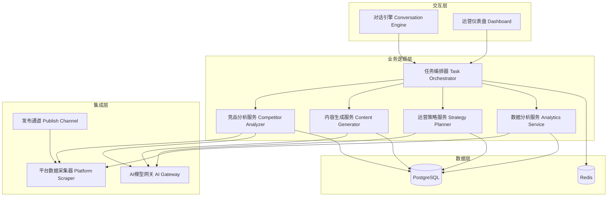

# 设计文档：AI数字员工系统

## 概述

AI数字员工系统采用模块化微服务架构，以对话引擎为入口，串联竞品分析、内容生成、内容发布和运营分析等核心能力。系统的核心设计理念是"可直接发布"——所有产出内容均严格遵循目标平台规范，无需用户二次编辑。

技术栈选型：
- 后端：TypeScript + Node.js（主服务）
- AI能力：集成大语言模型 API（如 OpenAI GPT）用于文本生成和意图解析，集成图像生成模型用于视觉内容
- 数据库：PostgreSQL（结构化数据）+ Redis（缓存与任务队列）
- 前端：React + TypeScript（Web 端运营仪表盘）
- 消息队列：Bull（基于 Redis 的任务调度）

## 架构

系统采用分层架构，核心分为四层：



核心数据流：
1. 用户通过对话引擎或仪表盘发起请求
2. 任务编排器解析请求，拆分为子任务并编排执行顺序
3. 各业务服务通过 AI 网关调用模型能力，通过平台采集器获取外部数据
4. 产出内容经过格式化后存储，通过发布通道推送到目标平台

## 组件与接口

### 1. 对话引擎（Conversation Engine）

负责自然语言理解和意图识别。

```typescript
interface ConversationEngine {
  // 解析用户输入，返回结构化意图
  parseIntent(input: string): Promise<ParsedIntent>;
  // 生成澄清问题
  generateClarification(context: ConversationContext): Promise<string>;
  // 管理对话上下文
  getContext(sessionId: string): Promise<ConversationContext>;
}

interface ParsedIntent {
  taskType: TaskType;
  platform: Platform;
  category: string;        // 赛道/领域
  parameters: Record<string, unknown>;
  confidence: number;
}

type TaskType =
  | 'competitor_analysis'
  | 'trending_tracking'
  | 'content_generation'
  | 'content_publish'
  | 'strategy_generation'
  | 'operation_summary'
  | 'comment_analysis';

type Platform = 'xiaohongshu' | 'douyin' | 'weibo' | 'wechat';
```

### 2. 任务编排器（Task Orchestrator）

负责将用户意图转化为可执行的任务计划。

```typescript
interface TaskOrchestrator {
  // 根据意图创建执行计划
  createPlan(intent: ParsedIntent): Promise<ExecutionPlan>;
  // 执行计划
  executePlan(planId: string): Promise<void>;
  // 获取任务状态
  getTaskStatus(taskId: string): Promise<TaskStatus>;
}

interface ExecutionPlan {
  id: string;
  steps: TaskStep[];
  status: PlanStatus;
  createdAt: Date;
}

interface TaskStep {
  id: string;
  type: TaskType;
  dependencies: string[];   // 依赖的前置步骤 ID
  parameters: Record<string, unknown>;
  status: 'pending' | 'running' | 'completed' | 'failed';
  result?: unknown;
}
```

### 3. 内容生成器（Content Generator）

负责生成可直接发布的内容。

```typescript
interface ContentGenerator {
  // 生成笔记内容
  generateNote(request: NoteRequest): Promise<Note>;
  // 基于反馈修改内容
  reviseNote(noteId: string, feedback: string): Promise<Note>;
  // 匹配热门标签
  matchTrendingTags(content: string, platform: Platform): Promise<string[]>;
}

interface NoteRequest {
  topic: string;
  platform: Platform;
  category: string;
  referenceMaterials?: Material[];
  style?: ContentStyle;
}

interface Note {
  id: string;
  title: string;
  textContent: string;
  images: ImageAsset[];
  tags: string[];
  platform: Platform;
  status: NoteStatus;
  platformPreview: PlatformPreview;
  createdAt: Date;
  updatedAt: Date;
}

type NoteStatus = 'draft' | 'ready' | 'published' | 'offline';
```

### 4. 竞品分析服务（Competitor Analyzer）

```typescript
interface CompetitorAnalyzer {
  // 采集竞品数据
  collectData(target: CompetitorTarget): Promise<CompetitorData>;
  // 生成分析报告
  generateReport(data: CompetitorData): Promise<CompetitorReport>;
  // 获取热点列表
  getTrendingTopics(platform: Platform, category?: string): Promise<TrendingTopic[]>;
}

interface CompetitorReport {
  id: string;
  target: CompetitorTarget;
  contentTrends: TrendAnalysis[];
  engagementMetrics: EngagementSummary;
  strategySuggestions: string[];
  generatedAt: Date;
  publishReady: boolean;
}
```

### 5. 发布通道（Publish Channel）

```typescript
interface PublishChannel {
  // 发布内容到平台
  publish(note: Note, options: PublishOptions): Promise<PublishResult>;
  // 定时发布
  schedulePublish(note: Note, scheduledTime: Date): Promise<ScheduleResult>;
  // 重试发布
  retryPublish(publishId: string): Promise<PublishResult>;
}

interface PublishResult {
  success: boolean;
  publishId: string;
  platformUrl?: string;
  error?: string;
  publishedAt?: Date;
}

interface PublishOptions {
  mode: 'auto' | 'manual';
  platform: Platform;
}
```

### 6. 运营策略服务（Strategy Planner）

```typescript
interface StrategyPlanner {
  // 生成运营策略
  generateStrategy(request: StrategyRequest): Promise<OperationStrategy>;
  // 调整策略节点
  adjustNode(strategyId: string, nodeId: string, changes: Partial<StrategyNode>): Promise<OperationStrategy>;
}

interface OperationStrategy {
  id: string;
  category: string;
  goal: string;
  nodes: StrategyNode[];
  publishReady: boolean;
  createdAt: Date;
}

interface StrategyNode {
  id: string;
  scheduledDate: Date;
  topic: string;
  contentType: string;
  frequency: string;
  expectedEffect: string;
  note?: Note;              // 该节点对应的具体内容
  status: 'planned' | 'content_ready' | 'published';
}
```

### 7. 数据分析服务（Analytics Service）

```typescript
interface AnalyticsService {
  // 监控内容互动数据
  trackEngagement(noteId: string): Promise<EngagementData>;
  // 生成运营报告
  generateSummary(timeRange: TimeRange): Promise<OperationSummary>;
  // 分析评论
  analyzeComments(noteId: string): Promise<CommentAnalysis>;
  // 生成优化建议
  getOptimizationSuggestions(): Promise<OptimizationSuggestion[]>;
  // 检测异常
  detectAnomalies(noteId: string): Promise<AnomalyAlert[]>;
}

interface EngagementData {
  noteId: string;
  views: number;
  likes: number;
  comments: number;
  favorites: number;
  shares: number;
  updatedAt: Date;
}

interface CommentAnalysis {
  noteId: string;
  totalComments: number;
  sentimentDistribution: { positive: number; neutral: number; negative: number };
  topKeywords: string[];
  summary: string;
}
```

## 数据模型

### 核心实体关系

```mermaid
erDiagram
    User ||--o{ Session : creates
    Session ||--o{ ExecutionPlan : contains
    ExecutionPlan ||--o{ TaskStep : has
    User ||--o{ Note : owns
    Note ||--o{ ImageAsset : contains
    Note ||--o{ PublishRecord : has
    Note ||--o{ EngagementData : tracks
    User ||--o{ OperationStrategy : owns
    OperationStrategy ||--o{ StrategyNode : contains
    StrategyNode ||--o| Note : references
    User ||--o{ CompetitorReport : owns
    CompetitorReport ||--o{ TrendAnalysis : contains

    User {
        string id PK
        string name
        string email
        json platformCredentials
        date createdAt
    }

    Note {
        string id PK
        string userId FK
        string title
        text textContent
        json tags
        string platform
        string status
        json platformPreview
        date createdAt
        date updatedAt
    }

    ImageAsset {
        string id PK
        string noteId FK
        string url
        int width
        int height
        string altText
    }

    PublishRecord {
        string id PK
        string noteId FK
        string platform
        boolean success
        string platformUrl
        string error
        date publishedAt
    }

    OperationStrategy {
        string id PK
        string userId FK
        string category
        string goal
        boolean publishReady
        date createdAt
    }

    StrategyNode {
        string id PK
        string strategyId FK
        string noteId FK
        date scheduledDate
        string topic
        string contentType
        string status
    }

    EngagementData {
        string id PK
        string noteId FK
        int views
        int likes
        int comments
        int favorites
        date updatedAt
    }

    CompetitorReport {
        string id PK
        string userId FK
        json target
        json strategySuggestions
        boolean publishReady
        date generatedAt
    }
}
```

### 数据库表设计要点

- `Note` 表的 `platformPreview` 字段存储 JSON 格式的平台预览数据，包含渲染所需的布局信息
- `PublishRecord` 记录每次发布尝试，支持失败重试追溯
- `StrategyNode` 通过 `noteId` 关联具体内容，实现策略与内容的解耦
- `EngagementData` 按时间序列存储，支持趋势分析
- 所有时间字段使用 UTC 时区存储


## 正确性属性

*正确性属性是一种在系统所有有效执行中都应成立的特征或行为——本质上是关于系统应该做什么的形式化陈述。属性作为人类可读规范与机器可验证正确性保证之间的桥梁。*

### Property 1：意图解析完整性

*For any* 包含有效任务类型、平台和赛道信息的自然语言指令，Conversation_Engine 解析后返回的 ParsedIntent 应包含正确的 taskType、platform 和 category 字段，且 confidence > 0。

**Validates: Requirements 1.1**

### Property 2：执行计划生成

*For any* 有效的 ParsedIntent，Task Orchestrator 生成的 ExecutionPlan 应包含至少一个 TaskStep，且每个 step 的类型与意图相关。

**Validates: Requirements 1.2**

### Property 3：任务依赖顺序执行

*For any* ExecutionPlan，其中 TaskStep 存在依赖关系时，所有 step 的实际执行顺序应满足依赖图的拓扑排序约束——即每个 step 仅在其所有依赖 step 完成后才开始执行。

**Validates: Requirements 1.3**

### Property 4：无效输入澄清

*For any* 无法解析为有效意图的用户输入，Conversation_Engine 应返回非空的澄清提示字符串，而非抛出异常或返回空结果。

**Validates: Requirements 1.4**

### Property 5：竞品数据采集完整性

*For any* 竞品目标（账号或关键词），采集返回的 CompetitorData 应包含内容数据、互动数据和发布频率三类信息，且各字段非空。

**Validates: Requirements 2.1**

### Property 6：竞品报告结构完整且可直接发布

*For any* CompetitorData，生成的 CompetitorReport 应包含内容趋势分析、互动数据摘要和策略建议三个部分，且 publishReady 标志为 true。

**Validates: Requirements 2.2, 2.4**

### Property 7：热点列表排序

*For any* 平台返回的 Trending_Topic 列表，列表应按热度值降序排列——即对于列表中任意相邻的两个元素，前者的热度值大于等于后者。

**Validates: Requirements 2.3**

### Property 8：热点变化检测

*For any* 两个时间点的热点数据快照，当热度排名发生显著变化（如 Top 10 中有超过 50% 的新话题）时，系统应触发通知事件。

**Validates: Requirements 2.5**

### Property 9：笔记可直接发布验证

*For any* 由 Content_Generator 生成的 Note，该 Note 应满足目标平台的所有发布规范：文本长度在平台限制内、图片尺寸符合平台要求、标签数量在允许范围内、且 platformPreview 字段包含完整的渲染数据。

**Validates: Requirements 3.1, 3.2, 3.4**

### Property 10：内容修改有效性

*For any* 已生成的 Note 和非空的用户反馈，reviseNote 返回的新 Note 应与原 Note 在内容上存在差异（textContent 或 images 不完全相同）。

**Validates: Requirements 3.5**

### Property 11：热门标签匹配

*For any* 生成的 Note，其 tags 列表应与当前平台 Trending_Topic 列表存在交集（至少包含一个热门标签）。

**Validates: Requirements 3.6**

### Property 12：发布结果结构正确性

*For any* 发布尝试，当 success 为 true 时 PublishResult 应包含非空的 platformUrl 和 publishedAt；当 success 为 false 时应包含非空的 error 字段。

**Validates: Requirements 4.2, 4.4**

### Property 13：定时发布调度一致性

*For any* OperationStrategy 中的 StrategyNode 列表，调度器为每个节点创建的发布任务的计划执行时间应与节点的 scheduledDate 一致。

**Validates: Requirements 4.3**

### Property 14：运营策略结构完整且可直接发布

*For any* 有效的赛道和运营目标输入，生成的 OperationStrategy 应包含至少一个 StrategyNode，每个节点包含 scheduledDate、topic、contentType、frequency 和 expectedEffect 字段，且策略的 publishReady 为 true。

**Validates: Requirements 5.1, 5.5**

### Property 15：策略节点内容完备

*For any* 生成的 OperationStrategy，其每个 StrategyNode 应关联一个状态为 Publish_Ready 的 Note。

**Validates: Requirements 5.2**

### Property 16：策略数据驱动性

*For any* 生成的 OperationStrategy，其节点的 topic 集合应与输入的 Trending_Topic 或 CompetitorReport 中的关键词存在交集。

**Validates: Requirements 5.3**

### Property 17：策略节点独立调整

*For any* OperationStrategy，调整其中一个 StrategyNode 的内容后，其余所有 StrategyNode 的字段值应保持不变。

**Validates: Requirements 5.4**

### Property 18：互动数据字段完整性

*For any* 已发布的 Note，trackEngagement 返回的 EngagementData 应包含 views、likes、comments、favorites 四个非负整数字段。

**Validates: Requirements 6.1**

### Property 19：运营数据聚合正确性

*For any* 时间范围内的 EngagementData 集合，generateSummary 返回的汇总数据中各指标总和应等于该集合中对应指标的逐条累加值。

**Validates: Requirements 6.2**

### Property 20：评论情感分布归一化

*For any* CommentAnalysis 结果，sentimentDistribution 中 positive + neutral + negative 的总和应等于 1.0（允许浮点误差 ±0.01）。

**Validates: Requirements 6.3**

### Property 21：异常波动检测

*For any* EngagementData 时间序列，当某个指标的变化幅度超过历史均值的 2 倍标准差时，detectAnomalies 应返回非空的 AnomalyAlert 列表。

**Validates: Requirements 6.5**

### Property 22：内容列表完整性

*For any* 用户拥有的 Note 集合，Operation_Dashboard 的列表视图应包含所有 Note，且每个 Note 显示的状态与数据库中的状态一致。

**Validates: Requirements 7.2**

### Property 23：内容筛选正确性

*For any* 筛选条件（平台、赛道、状态、时间范围）应用于 Note 集合后，返回的每一条 Note 都应满足所有指定的筛选条件。

**Validates: Requirements 7.4**

### Property 24：软删除与恢复往返

*For any* Note，执行删除操作后该 Note 不应出现在正常列表中，但执行恢复操作后该 Note 应重新出现在列表中且内容与删除前一致。

**Validates: Requirements 7.5**

## 错误处理

### 对话引擎错误

| 错误场景 | 处理方式 |
|---------|---------|
| 意图解析失败 | 返回澄清提示，引导用户补充信息 |
| 意图置信度过低 | 列出可能的意图选项供用户选择 |
| 对话上下文丢失 | 从数据库恢复最近的会话上下文 |

### 内容生成错误

| 错误场景 | 处理方式 |
|---------|---------|
| AI 模型调用超时 | 重试最多 3 次，间隔指数递增，最终失败则通知用户 |
| 生成内容不符合平台规范 | 自动裁剪/调整后重新验证，仍不通过则标记为草稿 |
| 图片生成失败 | 使用备选模板图片，通知用户可手动替换 |

### 发布错误

| 错误场景 | 处理方式 |
|---------|---------|
| 平台 API 认证失败 | 通知用户重新授权平台账号 |
| 发布内容被平台拒绝 | 记录拒绝原因，建议内容修改方向 |
| 网络超时 | 自动重试，记录到 PublishRecord |
| 定时发布错过时间窗口 | 立即执行或推迟到下一个合适时间，通知用户 |

### 数据采集错误

| 错误场景 | 处理方式 |
|---------|---------|
| 平台反爬限制 | 降低采集频率，使用缓存数据，通知用户数据可能不是最新 |
| 目标账号不存在 | 返回明确错误信息，建议检查账号名称 |
| 数据格式变更 | 记录异常，使用最近一次有效数据，触发维护告警 |

## 测试策略

### 测试框架

- 单元测试：Vitest
- 属性测试：fast-check（基于 Vitest 集成）
- API 测试：Supertest
- 端到端测试：Playwright（仪表盘 UI）

### 属性测试（Property-Based Testing）

每个正确性属性对应一个独立的属性测试，使用 fast-check 生成随机输入，每个测试至少运行 100 次迭代。

测试标注格式：`Feature: ai-digital-employee, Property {N}: {属性标题}`

关键属性测试：

1. **意图解析测试**：生成随机的自然语言指令变体，验证 Property 1（解析完整性）和 Property 4（无效输入处理）
2. **任务编排测试**：生成随机依赖图，验证 Property 3（拓扑排序执行）
3. **内容验证测试**：生成随机 Note 数据，验证 Property 9（平台规范合规）
4. **发布结果测试**：模拟随机成功/失败场景，验证 Property 12（结果结构正确性）
5. **策略节点独立性测试**：生成随机策略并修改单个节点，验证 Property 17（其余节点不变）
6. **数据聚合测试**：生成随机 EngagementData 集合，验证 Property 19（聚合正确性）
7. **情感分布测试**：生成随机评论分析结果，验证 Property 20（归一化）
8. **筛选正确性测试**：生成随机 Note 集合和筛选条件，验证 Property 23（筛选结果合规）
9. **软删除往返测试**：生成随机 Note，验证 Property 24（删除-恢复往返一致性）

### 单元测试

单元测试聚焦于具体示例和边界情况：

- 对话引擎：测试典型指令解析、边界输入（空字符串、超长文本）
- 内容生成：测试各平台的格式验证规则
- 发布通道：测试各种发布失败场景的错误处理
- 数据分析：测试聚合计算的边界情况（空数据集、单条数据）
- 策略生成：测试最小策略（单节点）和大型策略的生成

### 集成测试

- 对话引擎 → 任务编排器 → 业务服务的端到端流程
- 内容生成 → 发布通道的完整发布流程
- 策略生成 → 内容生成 → 定时发布的自动化流程
